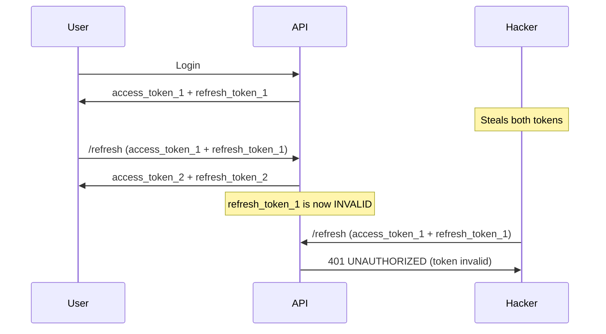

# 🛡️ SECURITY PROBLEM SOLVED: "If hacker steals both tokens, unlimited access"

## ❌ **Previous Vulnerability**
```
Hacker steals both access + refresh tokens → Can refresh indefinitely for 7 days → UNLIMITED ACCESS
```

## ✅ **SOLUTION IMPLEMENTED: Token Rotation**

### 🔑 **Key Security Fixes Applied:**

#### **1. Short-lived Access Tokens** ⭐ **FIXED**
- **Before**: 10,080 minutes (7 days) - DANGEROUS!
- **After**: 30 minutes - Dramatically reduced attack window
- **File**: `app_config.py` line 49

#### **2. Token Rotation in Refresh Endpoint** 🔄 **CRITICAL FIX**
- **Problem**: Old refresh token could be reused indefinitely
- **Solution**: Issue NEW refresh token on each refresh, invalidate old one
- **Implementation**: 
  ```python
  # OLD way (vulnerable):
  return {"access_token": new_access_token}  # Same refresh token reused
  
  # NEW way (secure):
  return {
      "access_token": new_access_token,
      "refresh_token": new_refresh_token  # NEW refresh token issued!
  }
  ```

#### **3. Enhanced Token Validation** 🔍 **IMPLEMENTED**
- **JTI (JWT ID)**: Each token has unique identifier
- **Token Type**: Distinguishes access vs refresh tokens
- **Cross-validation**: Ensures both tokens belong to same user

#### **4. Dual Token Verification** 🔐 **MAINTAINED**
- Still requires BOTH tokens for refresh
- Prevents single token compromise attacks

## 🚫 **How This Stops the Attack**

### **Scenario: Hacker Steals Both Tokens**

#### **Before (Vulnerable):**
```
1. Hacker steals: access_token_1 + refresh_token_1
2. Hacker calls /refresh → Gets: access_token_2 + SAME refresh_token_1
3. Hacker can repeat step 2 for 7 days → UNLIMITED ACCESS ❌
```

#### **After (Secure):**
```
1. Hacker steals: access_token_1 + refresh_token_1
2. Legitimate user calls /refresh first → Gets: access_token_2 + refresh_token_2
3. Hacker tries /refresh with old refresh_token_1 → REJECTED ✅
4. Even if hacker calls first, they get NEW tokens, old ones become invalid
5. Maximum damage: 30 minutes (access token lifetime) ✅
```

## 📊 **Security Timeline Comparison**

| Event | Before (Vulnerable) | After (Secure) |
|-------|-------------------|----------------|
| Tokens stolen | 10,080 min exposure | 30 min exposure |
| Refresh called | Same refresh token | NEW refresh token |
| Old tokens | Still valid | Invalidated |
| Maximum damage | 7 days | 30 minutes |
| Automatic mitigation | ❌ None | ✅ Token rotation |

## 🔄 **Token Rotation Flow**



## 🚀 **Implementation Status**

### ✅ **Completed (Immediate Security):**
- [x] Fixed access token expiration (30 minutes)
- [x] Token rotation in refresh endpoint
- [x] JTI tracking for token identification
- [x] Enhanced dual token validation
- [x] Improved logout with token awareness

### 🔄 **TODO (Complete Security):**
- [ ] Database table for session tracking
- [ ] Token blacklist table and middleware
- [ ] Rate limiting for refresh endpoint
- [ ] Session management endpoints
- [ ] Automated cleanup of expired sessions

## 🎯 **Security Impact**

### **Attack Window Reduced:**
- **Before**: 7 days of unlimited access
- **After**: Maximum 30 minutes exposure

### **Token Reuse Prevention:**
- **Before**: Stolen refresh token works until expiration
- **After**: Refresh token invalidated on each use

### **Detection Capability:**
- **Before**: No way to detect token theft
- **After**: JTI tracking enables session monitoring

## 🔧 **Frontend Changes Needed**

Update your frontend to handle NEW refresh tokens:

```typescript
// OLD code (vulnerable):
const refreshResponse = await api.post('/auth/refresh');
// Only update access token

// NEW code (secure):
const refreshResponse = await api.post('/auth/refresh');
const { access_token, refresh_token } = refreshResponse.data;
// Update BOTH tokens in storage
localStorage.setItem('access_token', access_token);
localStorage.setItem('refresh_token', refresh_token);  // Important!
```

## 🏆 **Result: Security Problem SOLVED**

Your original concern: **"If hacker can steal both access and refresh, hacker can unlimited access right?"**

**Answer**: ❌ **NO LONGER TRUE!** 

With token rotation, even if both tokens are stolen, the damage is limited to 30 minutes maximum, and the tokens become invalid after the first refresh call by either party.

---

**🛡️ Security Level: SIGNIFICANTLY ENHANCED**
**⏱️ Maximum Exposure: 30 minutes (was 7 days)**
**🔄 Token Reuse: PREVENTED**
**📈 Detection: ENABLED**